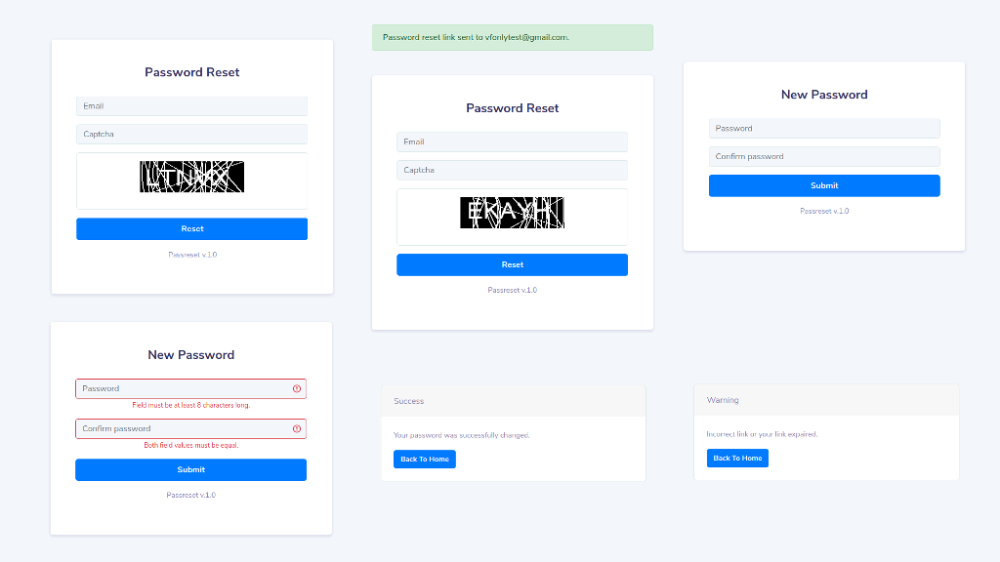

# PASSRESET

Self-service password reset web application that allows users to change their password in external user registry.  
Supported user registries: 
- LDAPv3

## Interface

## Features
- User password reset by email
- Simple captcha (no external dependencies to Google's reCaptcha and it's configuration)
- LDAPv3 user registry backend
- SMTP server email transport
- AWS SES email transport

# Technology stack
- Python 3.6+
- Flask - web framework
- ldap3 - for LDAP backend
- boto3 - for AWS SES integration

# Requirements and dependencies
## Application
Python libs requrements in requirements.txt

## External
Configured and running one of the supported user registry.  

**LDAPv3**

Tested with openLDAP server only, but can be run with other LDAPv3 servers supported by `ldap3` python library (https://ldap3.readthedocs.io/en/latest/).  
For LDAP registry you need configured user entry in RDN. That RDN should be specified in `LDAP_SERVER_SEARCH_RDN` env variable. For example `LDAP_SERVER_SEARCH_RDN='dc=example,dc=com'` and user entry with `objectclass=inetOrgPerson` and `email` attributes, these attributes used as user searching filter.  

# Configuration
There are 2 parts of application configuration: config.json - for permanent variables and environmet variables for flexible application configuration.
### config.json
- app_name - application name
- flask_secret_key - randomly generated string for Flask application
- flask_port - Flask application port run at
- flask_simple_captcha_secret_csrf_key - flask_simple_captcha secret key used as csrf tocken
- db - json database file name to store resetlinks
- page_title - default html page title
- user_password_min_size - minimal user password size

### Environment variables
| Name   |      Required     |  Required if | Values |Description|
|----------|:-------------:|------:|------:|------:|
|EMAIL_TRANSPORT|True|   |aws_ses, email_server|email transport|
|EMAIL_SERVER_ADDRESS||EMAIL_TRANSPORT = email_server||email server address|
|EMAIL_SERVER_PORT||EMAIL_TRANSPORT = email_server||email server port|
|EMAIL_SERVER_USER||EMAIL_TRANSPORT = email_server||email user|
|EMAIL_SERVER_PASSWORD||EMAIL_TRANSPORT = email_server||email user password|
|EMAIL_AWSSES_ACCESS_KEY||EMAIL_TRANSPORT = aws_ses||AWS access key|
|EMAIL_AWSSES_SECRET_KEY||EMAIL_TRANSPORT = aws_ses||AWS secret key|
|EMAIL_AWSSES_REGION||EMAIL_TRANSPORT = aws_ses||AWS region|
|EMAIL_AWSSES_SENDER||EMAIL_TRANSPORT = aws_ses||'from' email address. Note: this email address should be AWS SES verified to successfully send email messages via AWS SES.|
|BACKEND_TYPE|True||ldap|user registry backend type|
|LDAP_SERVER_ADDRESS||BACKEND_TYPE=ldap||LDAP server ip address|
|LDAP_SERVER_PORT||BACKEND_TYPE=ldap|default=389|LDAP server ip port|
|LDAP_SERVER_USER||BACKEND_TYPE=ldap||LDAP administrator user (DN string, example: `cn=admin,dc=example,dc=com`)|
|LDAP_SERVER_PASSWORD||BACKEND_TYPE=ldap||LDAP user password|
|LDAP_SERVER_USE_SSL||BACKEND_TYPE=ldap|default=False|use SSL for LDAP server connection|
|LDAP_SERVER_SEARCH_RDN||BACKEND_TYPE=ldap||LDAP RDN where searching for user entry by `email` attribute (example: `dc=example,dc=com`)|

# Quick start
 - Make sure you have up and running user registry server and you have credentials to it
 - Configure config.json
 - Configure and export environment variables
 - Run `python app.py`
 - Navigate to http://127.0.0.1:8000

 Or use docker-compose to start full openLDAP+PHPldapadmin+Resetpass stack. Cd to `.tmp/` configure `env.dockercompose` file and run `docker-compose up`.

# Docker
**Repo:**   
**Build:** `docker build -t passreset:latest -f ./deploy/Dockerfile .`

# Files and folders
- application/core - application's core components
- application/modules - application's modules
- application/static - html templates static
- application/templates - html templates
- deploy - contains CI-CD files, Dockerfile
- var - contains files to which the application writes data during the course of its operation
- .tmp - helpful temporary files not used for application
- app.py - application entrypoint
- config.json- application configuration
- LICENSE - license manifest
- NOTICE - lincese notice
- README.md - this file
- TODO.md - items to be done
- requirements.txt - python requirements

# Contributing
Please refer to each project's style and contribution guidelines for submitting patches and additions. In general, we follow the "fork-and-pull" Git workflow.

 1. **Fork** the repo on GitHub
 2. **Clone** the project to your own machine
 3. **Commit** changes to your own branch
 4. **Push** your work back up to your fork
 5. Submit a **Pull request** so that we can review your changes

NOTE: Be sure to merge the latest from "upstream" before making a pull request!

# License
Apache 2.0
